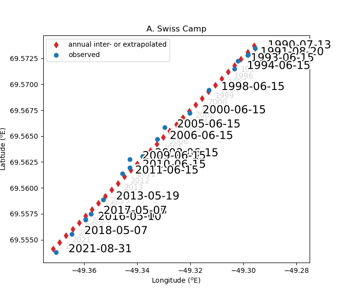
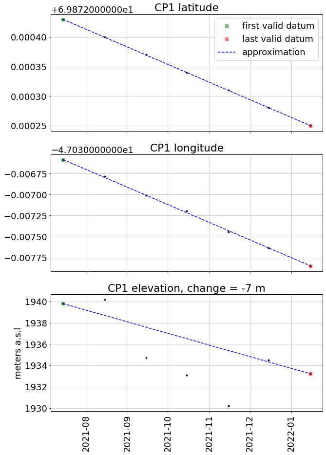
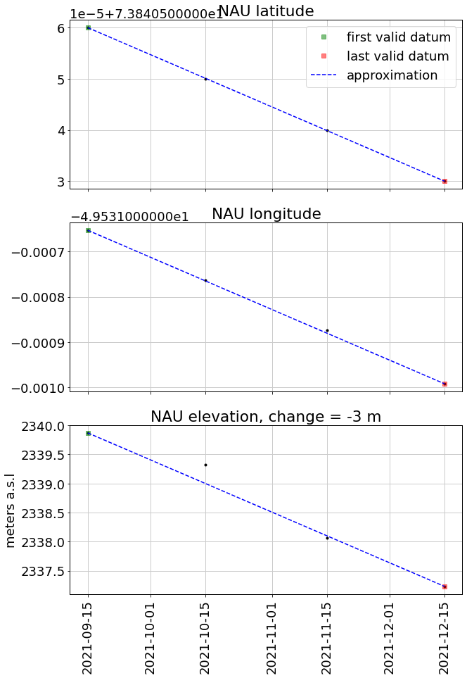
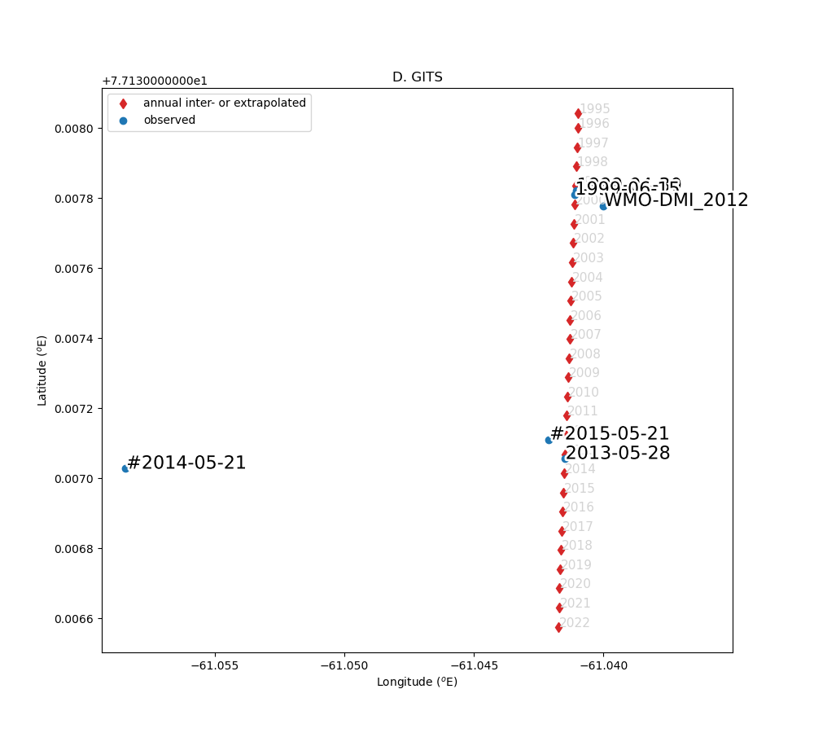
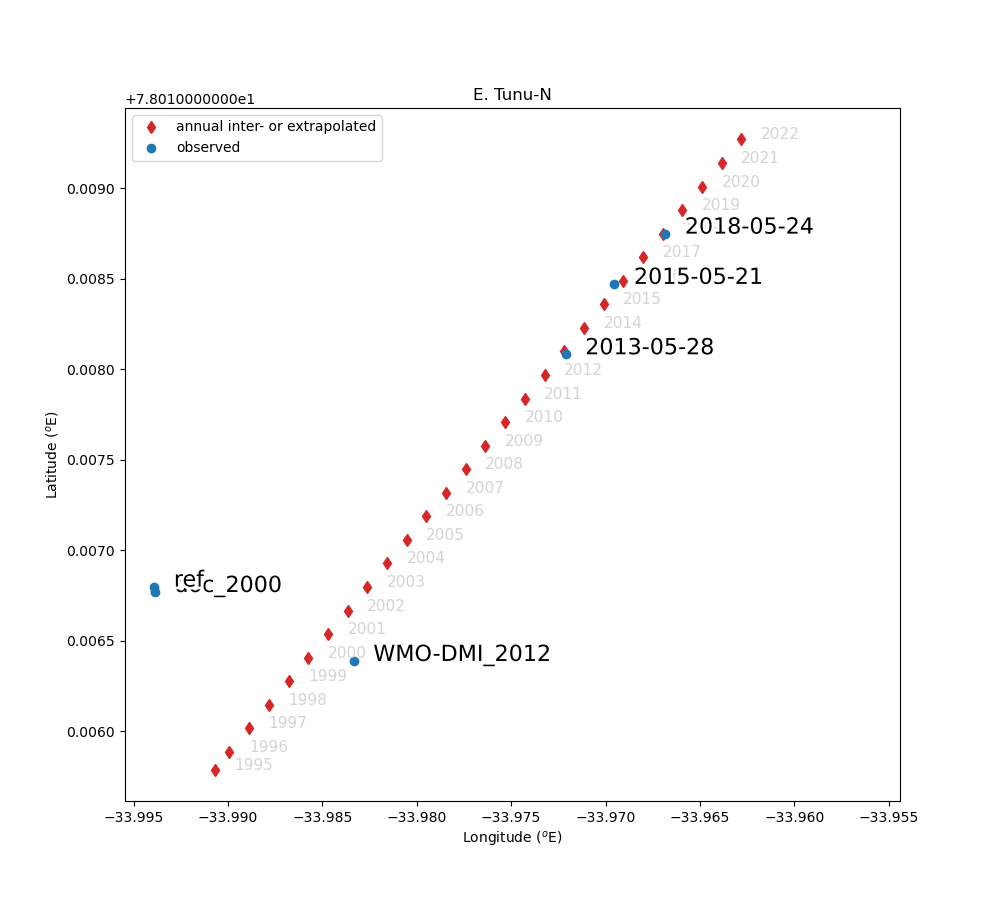
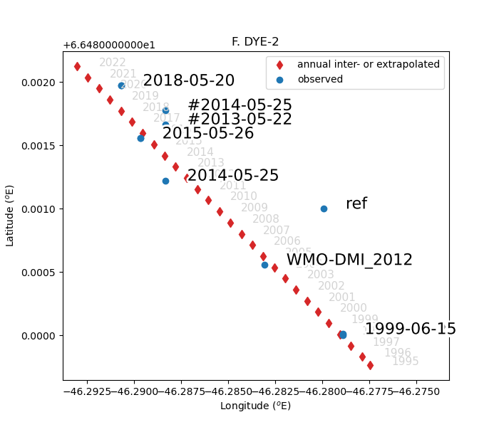
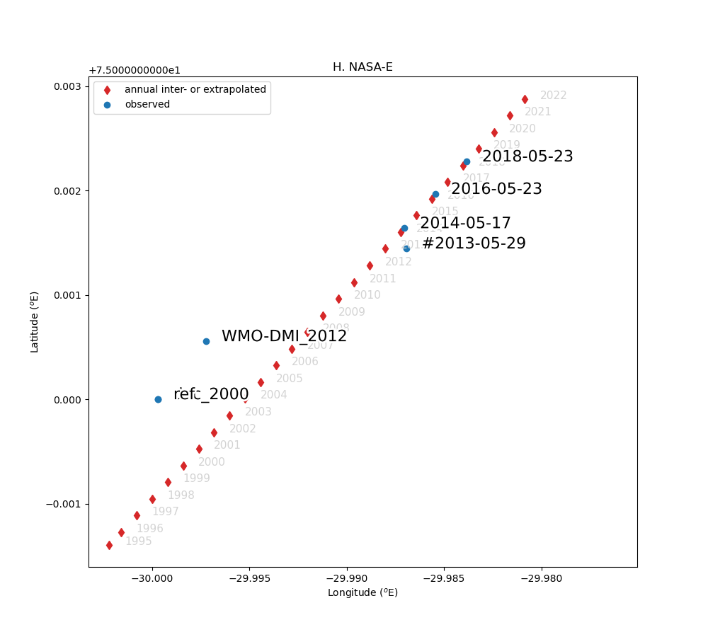
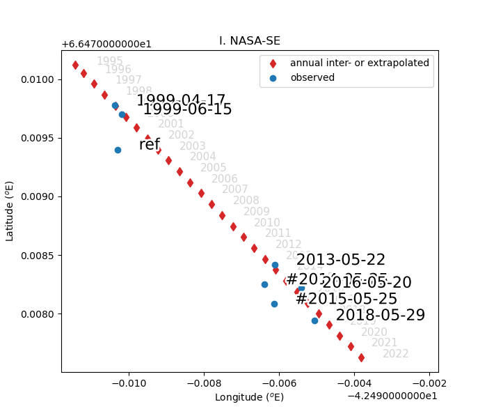
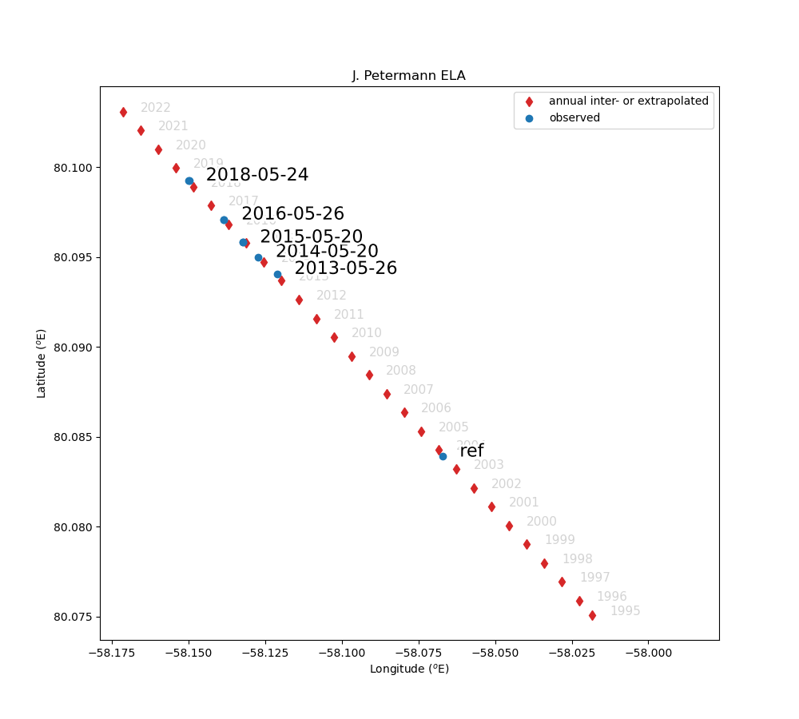

# GC-Net weather station positions processing scripts
J. Box and B. Vandecrux

The compilation of coordinates is available [here](https://docs.google.com/spreadsheets/d/1R2SA7rqo9PHfAAGeSVgy7eWVHRugV8Z3nbWga5Xin1U/edit?usp=sharing)

All the field books are available [here](https://github.com/GEUS-Glaciology-and-Climate/GC-Net-level-1-data-processing/tree/main/metadata/Field%20Books)

JAR1 has daily position from 2009-05-10 to 2009-10-31:

