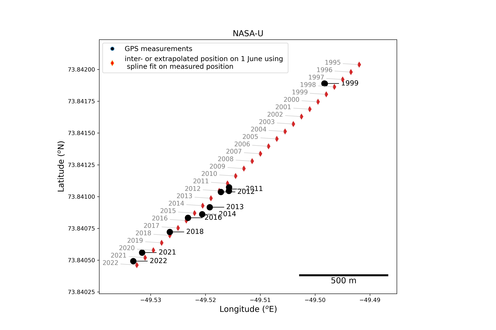
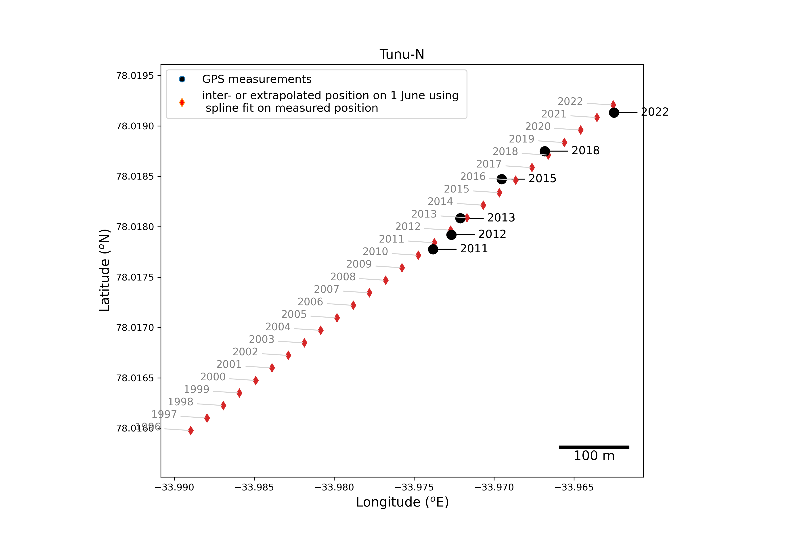
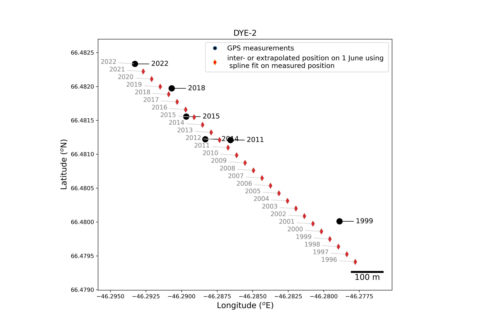
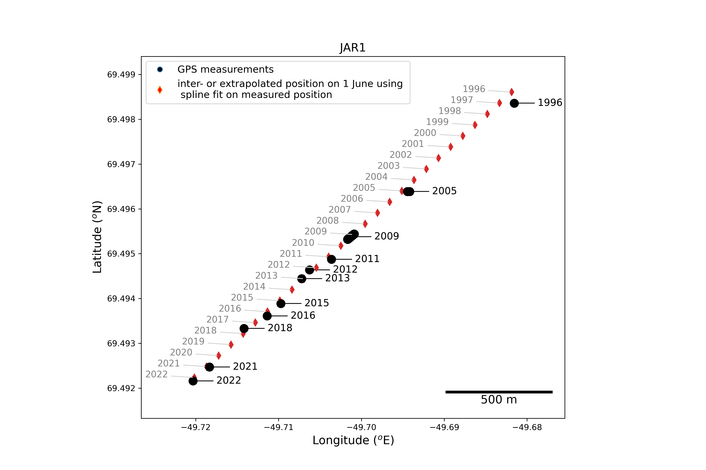

# GC-Net weather station positions processing scripts

## vertical positions (elevation above mean sea level)

J. Box

We estimate the time-dependence of GC-Net site elevations over the 1995-2019 period using NASA Airborne Topographic Mapper (ATM) surveys. 

The magenta line is the linear regression fit made to multi-year ATM data within 2 km of GC-Net positions, where:

<b>time-dependent elevation = time * elev_linear_slope + elev_linear_intercept</b>

Elevation units = meters. Time format is decimal year, .e.g., 1996.8972. The column headers **elev_linear_slope** and **elev_linear_intercept** are site-specific as in the above-linked table.

Site specific linear function coefficients to estimate elevations versus time time appear in [this table](https://github.com/GEUS-Glaciology-and-Climate/GCNet_positions/blob/main/ATM/output/GC-Net_elevations_solely_from_ATM_fit.csv).

Find figures [here](https://github.com/GEUS-Glaciology-and-Climate/GCNet_positions/tree/main/ATM/Figs).

This work applies wwo scripts, first that to [find the closest ATM data](https://github.com/GEUS-Glaciology-and-Climate/GCNet_positions/blob/main/ATM/find_AWS_elev_from_ATM_data.py) and that to [estimate the elevation over time](https://github.com/GEUS-Glaciology-and-Climate/GCNet_positions/blob/main/analyze_AWS_elevs_including_ATM.py). Read inside the scripts for further info e.g. on obtaining raw ATM data.

## horizontal positions

J. Box and B. Vandecrux

This script processes the compilation of coordiantes gathered at the GC-Net sites.
Most of the coordinates were obtained with handheld GPSs with varying accuracies.
For each site, we then fit use a spline of order one to inter- or extrapolate the station summer position.
Consequently, the fit does not necessarily match with the observation for a given year.

Only for the following sites could the yearly position be estimated due to sufficient coordinates and surface velocities above the GPS accuracy level:
Swiss Camp
Crawford Point 1
DYE-2
EastGRIP
Humboldt
JAR1
NASA-E
NASA-U
NASA-SE
Petermann ELA
Tunu-N

The compilation of coordinates is available [here](https://docs.google.com/spreadsheets/d/1R2SA7rqo9PHfAAGeSVgy7eWVHRugV8Z3nbWga5Xin1U/edit?usp=sharing)

All the field books are available [here](https://doi.org/10.5281/zenodo.7728549)

JAR1 has daily position from 2009-05-10 to 2009-10-31:

