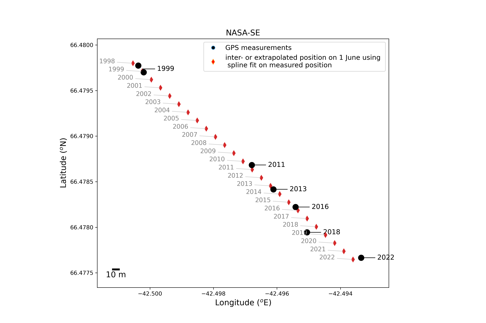

# GC-Net weather station positions processing scripts
J. Box and B. Vandecrux

This script processes the compilation of coordiantes gathered at the GC-Net sites.
Most of the coordinates were obtained with handheld GPSs with varying accuracies.
For each site, we then fit use a spline of order one to inter- or extrapolate the station summer position.
Consequently, the fit does not necessarily match with the observation for a given year.

The compilation of coordinates is available [here](https://docs.google.com/spreadsheets/d/1R2SA7rqo9PHfAAGeSVgy7eWVHRugV8Z3nbWga5Xin1U/edit?usp=sharing)

All the field books are available [here](https://github.com/GEUS-Glaciology-and-Climate/GC-Net-level-1-data-processing/tree/main/metadata/Field%20Books)

JAR1 has daily position from 2009-05-10 to 2009-10-31:

