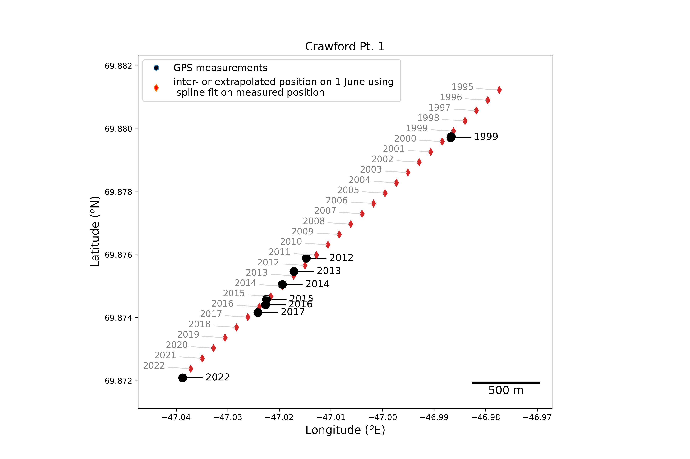
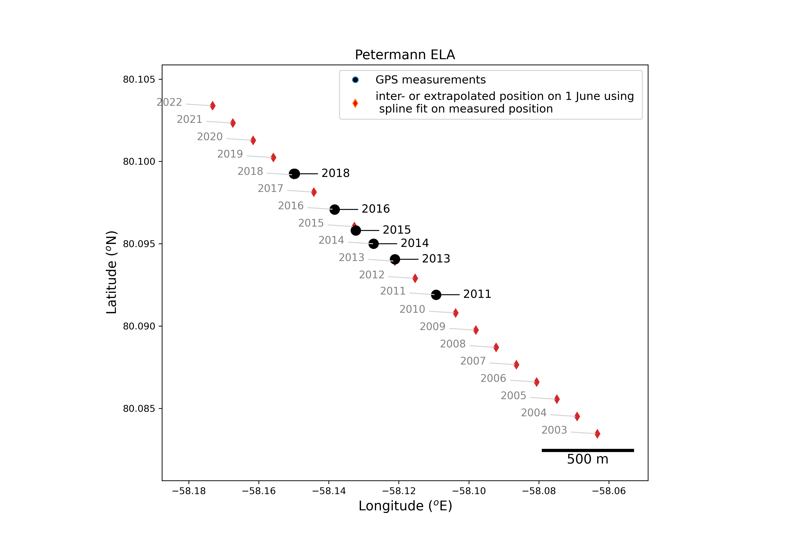

# GC-Net weather station positions processing scripts

J. Box and B. Vandecrux

## vertical positions (elevation above mean sea level)

by obtaining NASA Airborne Topographic Mapper data nearby GC-Net positions, we estimate the site elevation over time.

linear functions to estimate elevation v time are based on [this table](https://github.com/GEUS-Glaciology-and-Climate/GCNet_positions/blob/main/ATM/output/GC-Net_elevations_solely_from_ATM_fit.csv) where elevation = time in decimal years * elev_linear_slope + elev_linear_intercept. 

## horizontal positions
This script processes the compilation of coordiantes gathered at the GC-Net sites.
Most of the coordinates were obtained with handheld GPSs with varying accuracies.
For each site, we then fit use a spline of order one to inter- or extrapolate the station summer position.
Consequently, the fit does not necessarily match with the observation for a given year.

Only for the following sites could the yearly position be estimated due to sufficient coordinates and surface velocities above the GPS accuracy level:
Swiss Camp
Crawford Point 1
DYE-2
EastGRIP
Humboldt
JAR1
NASA-E
NASA-U
NASA-SE
Petermann ELA
Tunu-N

The compilation of coordinates is available [here](https://docs.google.com/spreadsheets/d/1R2SA7rqo9PHfAAGeSVgy7eWVHRugV8Z3nbWga5Xin1U/edit?usp=sharing)

All the field books are available [here](https://doi.org/10.5281/zenodo.7728549)

JAR1 has daily position from 2009-05-10 to 2009-10-31:

